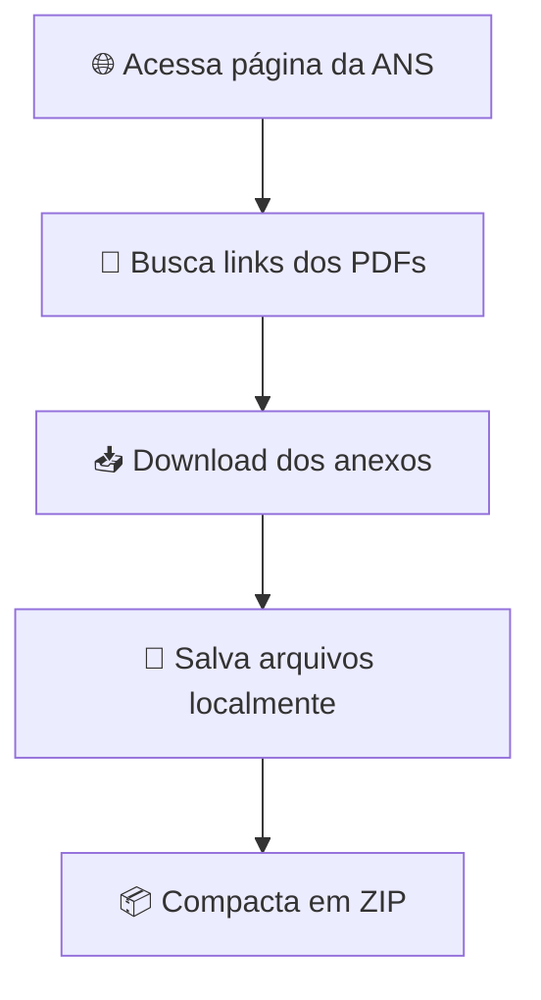

# 📥 Downloader e Compactador de PDFs - ANS

<p align="center">
  
  
  
  
</p>

<p align="center">
Automação em Python para download e compactação dos PDFs dos Anexos da ANS.
</p>

---

# 📌 Sobre o Projeto

Este projeto automatiza o processo de:

* 🌐 Acesso à página oficial da ANS
* 🔎 Busca automática pelos PDFs dos Anexos I e II
* 📥 Download dos documentos
* 📦 Compactação em arquivo ZIP

O objetivo é facilitar o armazenamento, organização e compartilhamento dos documentos oficiais disponibilizados pela **ANS (Agência Nacional de Saúde Suplementar)**.

---

# ✨ Funcionalidades

## 🔍 Busca Automática dos PDFs

O sistema acessa a página oficial da ANS e identifica automaticamente os links dos arquivos PDF dos anexos.

---

## 📥 Download Automático

Realiza o download dos arquivos encontrados diretamente para uma pasta local.

---

## 📦 Compactação em ZIP

Após o download, todos os PDFs são compactados automaticamente em um único arquivo `.zip`.

---

## 📁 Criação Automática de Diretórios

Caso a pasta de destino não exista, ela será criada automaticamente.

---

## ⚠ Tratamento de Erros

O projeto possui tratamento básico para:

* Falhas de conexão
* Links inválidos
* Problemas durante download
* Erros de compactação

---

# 🧰 Tecnologias Utilizadas

| Tecnologia                                                                                                           | Função                    |
| -------------------------------------------------------------------------------------------------------------------- | ------------------------- |
|  **Python 3.x** | Linguagem principal       |
| 🌐 **Requests**                                                                                                      | Requisições HTTP          |
| 🍲 **BeautifulSoup4**                                                                                                | Web Scraping              |
| 📦 **ZipFile**                                                                                                       | Compactação dos arquivos  |
| 📁 **OS**                                                                                                            | Manipulação de diretórios |

---

# ⚙️ Fluxo do Processo



---

# 📋 Requisitos

## Ambiente

* Python 3.x

## Bibliotecas necessárias

* requests
* beautifulsoup4

---

# 🚀 Instalação

## 1️⃣ Clone o repositório

```bash id="zv3g4k"
git clone https://github.com/seu_usuario/seu_repositorio.git
```

---

## 2️⃣ Acesse a pasta do projeto

```bash id="kq3m1p"
cd seu_repositorio
```

---

## 3️⃣ Crie um ambiente virtual (Opcional)

### Linux/macOS

```bash id="wmu8pk"
python -m venv venv
source venv/bin/activate
```

### Windows

```bash id="7i6k3j"
venv\Scripts\activate
```

---

## 4️⃣ Instale as dependências

```bash id="x7ap3r"
pip install requests beautifulsoup4
```

---

# ▶️ Como Executar

Execute o script principal:

```bash id="6eq7q4"
python app.py
```

---

# 📂 Estrutura do Projeto

```bash id="t1s1fi"
.
├── app.py
├── downloads/
├── arquivos.zip
├── requirements.txt
└── README.md
```

---

# 📥 Resultado Esperado

Após a execução:

✔ PDFs dos anexos baixados
✔ Arquivos salvos localmente
✔ ZIP gerado automaticamente

Exemplo:

```bash id="uvt3p5"
arquivos_ans.zip
```

---

# 🔒 Tratamento de Exceções

O sistema realiza validações para evitar falhas comuns como:

* ❌ Timeout de conexão
* ❌ Página indisponível
* ❌ Arquivos inexistentes
* ❌ Erros de escrita em disco

---

# 📈 Possíveis Melhorias Futuras

* 🖥 Interface gráfica
* ☁ Upload automático para nuvem
* 📅 Agendamento automático de downloads
* 🔔 Sistema de notificações
* 🧠 Identificação automática de novos anexos
* 📊 Logs detalhados de execução

---

# 🤝 Contribuição

Contribuições são bem-vindas!

1. Faça um Fork
2. Crie uma branch
3. Commit suas alterações
4. Abra um Pull Request

---

# 📄 Licença

Este projeto está sob a licença MIT.

---

<p align="center">
Desenvolvido com ❤️ usando Python
</p>
